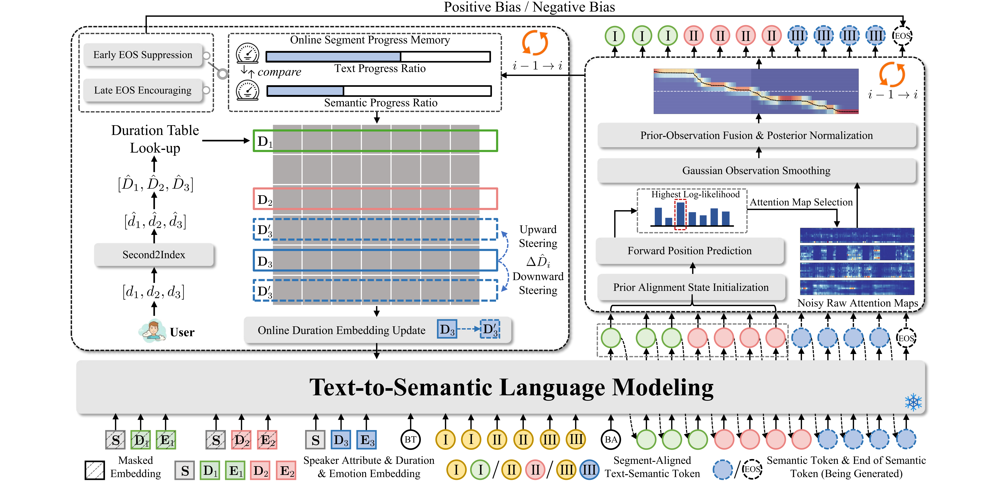

<h1 align="center">
  
  &nbsp;<strong>TED-TTS</strong>
</h1>

### <em>Training-Free Intra-Utterance Emotion and Duration Control for Text-to-Speech Synthesis</em>

<p>
  <a href="https://simon-leong.github.io/TED-TTS-DemoPage/"></a>
  <a href="https://arxiv.org/abs/2601.03170"></a>
  <a href="./TED-TTS%20Training-Free%20Intra-Utterance%20Emotion%20and%20Duration%20Control%20for%20Text-to-Speech%20Synthesis.pdf"></a>
  <a href="https://simon-leong.github.io/TED-TTS-DemoPage/"></a>
  <a href="https://github.com/index-tts/index-tts"></a>
  <a href="./licenses/LICENSE"></a>
</p>

</div>

---

## Overview

Existing controllable TTS methods are largely restricted to **inter-utterance** control, and the few that target **intra-utterance** expression typically depend on non-public datasets or complex multi-stage training. **TED-TTS** removes both barriers: it is a **training-free** controllable framework that augments any pretrained zero-shot TTS backbone (like [IndexTTS-2](https://github.com/index-tts/index-tts)) with two complementary inference-time strategies. To eliminate the need for segment-level manual prompt engineering, we additionally release **MED-TTS**, a 30,000-sample multi-emotion and duration-annotated text dataset that enables LLM-based automatic prompt construction.

<p align="center">
  
  <br>
  <em>Overview of our training-free framework for fine-grained intra-utterance emotion and duration control, illustrating the transition from the second (red) segment to the third (blue) segment via segment-aware duration steering (left) and segment-aware emotion conditioning (right) strategy.</em>
</p>

---

## News

- **2026-05** — Open-source release: code **v1** and MED-TTS dataset **v1**.
- **2026-04** — Accepted to **ACL 2026 Main**.
- **2026-01** — ArXiv preprint released: [`2601.03170`](https://arxiv.org/abs/2601.03170).

---

## Setup

### 1. Environment

TED-TTS uses the same runtime environment as IndexTTS-2. The recommended workflow is via [`uv`](https://docs.astral.sh/uv/getting-started/installation/):

```bash
git clone <this-repo-url>
cd TED-TTS

# Pull large binary artifacts
git lfs install
git lfs pull

# Install all dependencies (CUDA >= 12.8 recommended)
uv sync --all-extras
```

Without `uv`, you can fall back to `pip`:

```bash
pip install -e .
```

**China mirror** — if PyPI is slow, add a mirror via `uv`'s `extra-index-url`:

```bash
uv sync --all-extras \
    --extra-index-url https://mirrors.tuna.tsinghua.edu.cn/pypi/web/simple
# or: --extra-index-url https://mirrors.aliyun.com/pypi/simple
```

**Windows** — DeepSpeed is optional; if its wheel fails to build, the code falls back to standard PyTorch inference automatically.

### 2. Model Checkpoints

Download the upstream IndexTTS-2 weights (TED-TTS introduces **no new weights**):

```bash
# Option A: HuggingFace
hf download IndexTeam/IndexTTS-2 --local-dir=checkpoints

# Option B: ModelScope
modelscope download --model IndexTeam/IndexTTS-2 --local_dir checkpoints
```

For faster downloads in China, set `HF_ENDPOINT=https://hf-mirror.com` before running `hf download`.

### 3. Datasets

TED-TTS requires two datasets, both placed under `datasets/`:

| Dataset | Purpose | Download | Target path |
|---|---|---|---|
| **ESD** (Emotional Speech Dataset) | Speaker and emotion prompt audio used at inference | [HLTSingapore/Emotional-Speech-Data](https://github.com/HLTSingapore/Emotional-Speech-Data) | `datasets/Emotion Speech Dataset/` |
| **MED-TTS** (proposed) | Multi-segment emotion text manifests | [HuggingFace](https://huggingface.co/datasets/Chanson-0803/MED-TTS) | `datasets/MED-TTS/test_samples/` |

**Out-of-the-box subset vs. Full dataset.**
The repository ships a small ready-to-run subset under `datasets/MED-TTS/test_samples/` — `eng.json` and `chn.json`, **5 samples each**, so the inference scripts work immediately after cloning, purely as a sanity-check.

For at-scale evaluation, download the full MED-TTS corpus from [HuggingFace](https://huggingface.co/datasets/Chanson-0803/MED-TTS) and convert each split into the **same JSON schema as the shipped `test_samples/*.json`** (see the [MED-TTS JSON schema](#med-tts-json-schema) section below for the exact field-level layout). Place the resulting `eng.json` / `chn.json` under `datasets/MED-TTS/test_samples/` and `infer_batch.py` will pick them up without any code change.

The expected final layout:

```
TED-TTS/
├── checkpoints/                       # IndexTTS-2 model weights
├── datasets/
│   ├── Emotion Speech Dataset/        # ESD
│   │   ├── 0001/{Angry,Happy,Neutral,Sad,Surprise}/
│   │   ├── 0002/...
│   │   └── 0020/...
│   └── MED-TTS/test_samples
│       ├── eng.json
│       └── chn.json
├── indextts/                          # core code
├── infer_single.py                    # single-sample entry 
├── infer_batch.py                     # batch entry         
└── ...
```

---

## Inference

TED-TTS exposes **six inference modes** that progressively combine emotion and duration controls. Modes 3–5 are the paper's core contributions.

### Six Modes at a Glance

| Mode | Emotion Control | Duration Control | Typical Use |
|:----:|---|---|---|
| **0** | None (speaker prompt drives both timbre and emotion) | — | Single-emotion baseline |
| **1** | Reference audio + `emo_alpha` | — | Style transfer from a reference clip |
| **2** | 8-dimensional emotion vector | — | Explicit single-vector control |
| **3** | Per-segment emotion text descriptions (`\|`-separated) | — | Multi-segment emotion |
| **4** | Mode 3 + global EOS bias | Global | Multi-segment emotion + total-length control |
| **5** | Mode 3 + global + local | Global + Intra-segment | Full method (multi-segment emotion + per-segment length) |

### Single-sample inference

Every mode runs out-of-the-box with sensible defaults; you only need to override what is mode-specific.

```bash
# Mode 0 — no emotion control (baseline)
python infer_single.py --mode 0 --output out_mode0.wav

# Mode 1 — emotion reference audio + alpha
python infer_single.py --mode 1 \
    --emo_audio "./datasets/Emotion Speech Dataset/0011/Angry/0011_000351.wav" \
    --emo_alpha 0.8 \
    --output out_mode1.wav

# Mode 2 — 8-dim emotion vector (HAP ANG SAD FEA HAT LOW SUR NEU)
python infer_single.py --mode 2 \
    --emo_vector 0 0 0 0 0 0 0.45 0 \
    --output out_mode2.wav

# Mode 3 — per-segment emotion text (defaults: 3 segments "happy|angry|neutral")
python infer_single.py --mode 3 --output out_mode3.wav

# Mode 4 — Mode 3 + global duration control (defaults: target_seconds=[2.44, 2.12, 1.6])
python infer_single.py --mode 4 --output out_mode4.wav

# Mode 5 — full method (Mode 3 + global + local duration)
python infer_single.py --mode 5 --output out_mode5.wav
```

Customise text, segments, and targets with `--text`, `--emo_text`, `--target_seconds`, etc. Run `python infer_single.py --help` for the full reference.

> **Output location.** `--output` defaults to `./results/output.wav`. The `results/` directory is created on first run and is git-ignored, so repeated runs simply overwrite the same file unless you pass a different `--output` path.

### Batch inference

Drive inference from a MED-TTS-style JSON manifest:

```bash
DATA=./datasets/MED-TTS/test_samples/eng.json

# Modes 0/2/3/4/5 derive everything from the JSON automatically
for m in 0 2 3 4 5; do
    python infer_batch.py --mode $m \
        --data_file $DATA \
        --save_dir ./results/batch_mode$m \
        --max_samples 10
done

# Mode 1 still needs an external emotion reference
python infer_batch.py --mode 1 \
    --data_file $DATA \
    --emo_audio "./datasets/Emotion Speech Dataset/0011/Angry/0011_000351.wav" \
    --emo_alpha 0.8 \
    --save_dir ./results/batch_mode1 \
    --max_samples 10
```

> **Output location.** `--save_dir` defaults to `./results`. Each utterance is written as `{language}_{sent_idx:04d}_mode{N}.wav` under that directory (e.g. `./results/english_0000_mode5.wav`). The directory is created automatically.

<h4 id="med-tts-json-schema">MED-TTS JSON schema</h4>

Each entry in `eng.json` / `chn.json` is **one utterance**, structured as a single JSON object. `infer_batch.py` reads only the fields listed below, and any additional keys are ignored. A minimal example:

```json
{
  "output": {
    "language": "english",
    "segments": [
      {
        "lines_seg":           "Raindrops splatter harshly, each one a stinging reminder ",
        "emotion":             "Angry",
        "emotion_description": "The voice is tense and sharp, with a biting edge.",
        "time":                "2.4",
        "prompt_wav":          "0011/Neutral/0011_000001.wav"
      },
      {
        "lines_seg":           "until giggles fill the air like dancing fairy dust.",
        "emotion":             "Happy",
        "emotion_description": "The tone turns light and airy, full of playful joy.",
        "time":                "2.0",
        "prompt_wav":          "0011/Neutral/0011_000001.wav"
      }
    ]
  }
}
```

#### Converting the MED-TTS dump into the inference schema

The full HuggingFace release ships `MEDTTS-EN.json` / `MEDTTS-ZH.json`, where each entry follows the **richer source schema** below (text + per-segment emotion + per-segment duration annotation, but **no audio prompts**):

```json
{
  "sample_id": "en_000000",
  "meta": {
    "language": "en",
    "text_category": "Novelistic Description",
    "annotation_type": "automatic",
    "generation_model": "DeepSeek"
  },
  "utterance": {
    "text": "Her voice rose like a storm, but the sight of playful puppies quickly turned her ire into bubbling laughter.",
    "emotion_flow": ["Angry", "Happy"]
  },
  "segments": [
    {
      "segment_id":          0,
      "text":                "Her voice rose like a storm,",
      "emotion":             "Angry",
      "emotion_description": "Voice is loud, sharp, and rising with a forceful, tense edge.",
      "duration_sec":        1.8,
      "start_time":          0.0,
      "end_time":            1.8
    },
    {
      "segment_id":          1,
      "text":                "but the sight of playful puppies quickly turned her ire into bubbling laughter.",
      "emotion":             "Happy",
      "emotion_description": "Tone brightens, becoming lighter, quicker, and infused with warm, joyful energy.",
      "duration_sec":        3.9,
      "start_time":          1.8,
      "end_time":            5.7
    }
  ]
}
```

To turn the full dump into a file `infer_batch.py` can consume, apply this field-by-field remapping per utterance:

| Inference field | Source field in `MEDTTS-{EN,ZH}.json` | Conversion |
|---|---|---|
| `output.language` | `meta.language` | Map `"en"` → `"english"`, `"zh"` → `"chinese"`. |
| `output.segments[].lines_seg` | `segments[].text` | Direct copy. |
| `output.segments[].emotion` | `segments[].emotion` | Direct copy. |
| `output.segments[].emotion_description` | `segments[].emotion_description` | Direct copy. |
| `output.segments[].time` | `segments[].duration_sec` | Direct copy (numeric or numeric string both accepted). |
| `output.segments[].prompt_wav` | **must be attached manually** | A speaker-prompt wav path **relative to `--dataset_dir`** (defaults to the ESD root). See the [Speaker Prompts](#speaker-prompts) section below for defaults, fallback, and how to swap in your own voices. |

Source fields **not consumed** by inference (`sample_id`, `meta.text_category`, `meta.annotation_type`, `meta.generation_model`, `utterance.*`, `segments[].segment_id`, `segments[].start_time`, `segments[].end_time`) can be dropped during conversion.

---

## Speaker Prompts

TED-TTS is **zero-shot** with respect to speaker timbre: every inference run requires a *speaker reference wav* that defines the voice. To make the pipeline runnable straight out of the box, the repository ships a tiny default reference:

> `./datasets/Ref/0011_000001.wav`; a short Neutral utterance from ESD speaker `0011`.

Both inference entry points fall back to this clip when nothing else is specified.

### `infer_single.py`

The `--spk_audio` flag selects the speaker reference. Its default is **`./datasets/Ref/0011_000001.wav`**, so you can simply run:

```bash
# Use the bundled default voice
python infer_single.py --mode 3

# Use your own voice (any absolute or relative wav path)
python infer_single.py --mode 3 --spk_audio /path/to/your_voice.wav
```

### `infer_batch.py`

For batch inference each utterance can carry its own voice via the JSON's `prompt_wav` field. Resolution happens in three layers, in priority order:

| Priority | Source | Behaviour |
|:---:|---|---|
| 1 | CLI `--spk_audio <path>` | Global override: the **same** wav is used for every sample, regardless of JSON. |
| 2 | JSON `output.segments[0].prompt_wav` + `--dataset_dir` | Per-sample voice: the wav at `Path(--dataset_dir) / prompt_wav` is used. The default `--dataset_dir` is `./datasets/Emotion Speech Dataset` (the ESD root). |
| 3 | Bundled fallback `./datasets/Ref/0011_000001.wav` | If the path from layer 2 does **not** exist on disk, the bundled clip is used instead and a warning is printed. |

This gives you three usage patterns:

- **Out-of-the-box (no ESD, no flags)**: every sample falls through to layer 3 and is synthesised with the bundled voice.
  ```bash
  python infer_batch.py --mode 5 \
      --data_file ./datasets/MED-TTS/test_samples/eng.json
  ```
- **ESD downloaded**: JSON `prompt_wav` like `"0011/Neutral/0011_000001.wav"` is resolved under `./datasets/Emotion Speech Dataset/` and each utterance gets its own ESD voice. No extra flags required.
- **Your own voices**: two equivalent options:
  - *Option A — per-sample voices via a custom directory.*
    **Important:** `--dataset_dir` is **joined** with each sample's `prompt_wav` field from the JSON. You therefore need to change *two* things in lock-step:
    1. Lay your wav files out under a custom root, e.g. `./my_voices/alice/clip01.wav`, `./my_voices/bob/clip02.wav`.
    2. **Edit (or generate) your JSON** so every `prompt_wav` is a path *relative to that root* — e.g. `"alice/clip01.wav"`, **not** the shipped ESD-style paths like `"0011/Neutral/0011_000001.wav"`.

    ```bash
    python infer_batch.py --mode 5 \
        --data_file ./my_data/eng_custom.json \   # your own JSON with new prompt_wav fields
        --dataset_dir ./my_voices                  # your own voice root
    ```

  - *Option B — one voice for every sample.* `--spk_audio` takes an absolute or full relative path (no `--dataset_dir` join) and overrides JSON `prompt_wav` for every sample. This is the easiest way to test a single voice on the shipped JSON without editing it:
    ```bash
    python infer_batch.py --mode 5 \
        --data_file ./datasets/MED-TTS/test_samples/eng.json \
        --spk_audio /path/to/your_voice.wav
    ```
  Use Option A when each utterance should keep its own voice; use Option B for quick demos or when you don't want to touch the JSON.

---

## What We Modified

TED-TTS keeps the IndexTTS-2 codebase intact and adds a small, well-localized set of files.

### Paper-specific files (vs. upstream IndexTTS-2)

| File | Status | Purpose |
|---|---|---|
| `indextts/gpt/duration_controller.py` | **NEW** |  proportional-control law for per-segment duration. |
| `indextts/gpt/hmm.py` | **NEW** | text-position alignment used for emotion-twist detection. |
| `indextts/gpt/attn_map.py` | **NEW** | captures per-step attention as HMM observations. |
| `indextts/gpt/model_v2.py` | **NEW** | Adds IntraSeg hooks in `forward()` and `inference_speech()`. |
| `indextts/gpt/transformers_generation_utils.py` | **NEW** | Tracks per-beam emotion phase and reorders segment positions in beam search. |
| `indextts/infer_v2.py` | **NEW** | Forwards `duration_mode` / `target_duration_tokens` kwargs to the GPT model. |
| `infer_single.py` | **NEW** | Single-sample entry point covering all 6 modes. |
| `infer_batch.py` | **NEW** | Batch entry point covering all 6 modes. |

Everything else under `indextts/` (`BigVGAN/`, `s2mel/`, `utils/`, `conformer*`, `perceiver.py`, `transformers_gpt2.py`, …) is **basically unchanged** upstream IndexTTS-2 code.

### Hyperparameter Tuning Guide

> Because TED-TTS is **training-free**, duration-control behavior is sensitive to hyperparameter choices. Both controllers expose conservative defaults that work across different content settings; you are encouraged to tune them on your data.

#### (a) Global EOS duration control — used by Modes 4 and 5

- **Class**: `RemainingBudgetEOSProcessor` in [`indextts/gpt/model_v2.py`](indextts/gpt/model_v2.py)
- **Where to edit**: change the defaults at the class's `__init__`, or override them at the construction site inside `inference_speech()`.

| Parameter | Default | Effect |
|---|:---:|---|
| `min_ratio` | `0.5` | Below this progress ratio, strongly suppress EOS. |
| `neutral_ratio` | `(0.8, 1.2)` | Within this band, no bias is applied (let the model decide). |
| `max_ratio` | `2.0` | Above this ratio, strongly encourage EOS. |
| `max_negative_bias` | `-5.0` | Suppression strength. |
| `max_positive_bias` | `10.0` | Encouragement strength. |

#### (b) Local intra-segment duration control — used by Mode 5

- **Class**: `IntraSegmentDurationController` in [`indextts/gpt/duration_controller.py`](indextts/gpt/duration_controller.py)
- **Where to edit**: change the defaults at the class's `__init__`, or override them at the construction site in `indextts/gpt/model_v2.py`.

| Parameter | Default | Effect |
|---|:---:|---|
| `k_p` | `25.0` | Proportional gain — larger values give more aggressive corrections. |
| `eps` | `0.01` | Dead-band on the normalized progress error. |
| `delta_max` | `10` | Per-step cap on the cursor adjustment. |
| `update_freq` | `5` | Run the controller every N generation steps. |

A typical workflow is: keep the global controller's defaults, then sweep `k_p ∈ {15, 25, 35}` and `update_freq ∈ {3, 5, 10}` to find the best per-segment fidelity for your corpus.

---

## Repository Layout

```
TED-TTS/
├── README.md
├── TED-TTS ... Synthesis.pdf          # the paper (full filename in repo)
├── assets/
│   └── acl.png                        # method overview figure
├── licenses/                          # LICENSE / INDEX_MODEL_LICENSE* / DISCLAIMER
├── checkpoints/                       # IndexTTS-2 weights (downloaded by user)
│   └── config.yaml
├── datasets/                          # ESD + MED-TTS (downloaded by user)
├── indextts/
│   ├── __init__.py
│   ├── infer_v2.py                    # NEW
│   ├── gpt/
│   │   ├── duration_controller.py     # NEW
│   │   ├── hmm.py                     # NEW
│   │   ├── attn_map.py                # NEW
│   │   ├── model_v2.py                # NEW
│   │   ├── transformers_generation_utils.py  # NEW
│   │   ├── model.py, perceiver.py, conformer*  # upstream
│   │   └── transformers_{beam_search,gpt2,modeling_utils}.py  # upstream
│   ├── BigVGAN/                       # upstream
│   ├── s2mel/                         # upstream
│   └── utils/                         # upstream
├── infer_single.py                    # NEW
├── infer_batch.py                     # NEW
├── results/                           # inference outputs (created at runtime)
├── pyproject.toml, setup.py, requirements.txt, uv.lock, MANIFEST.in
```

---

## Acknowledgements

- [IndexTTS-2](https://github.com/index-tts/index-tts) — the pre-trained autoregressive TTS backbone we build on.
- [Emotional Speech Dataset (ESD)](https://github.com/HLTSingapore/Emotional-Speech-Data) — emotional speech corpus by HLT@NUS.
- [BigVGAN](https://github.com/NVIDIA/BigVGAN), [MaskGCT](https://github.com/open-mmlab/Amphion/tree/main/models/tts/maskgct), [OpenVoice](https://github.com/myshell-ai/OpenVoice) — upstream components reused via IndexTTS-2.
- The ACL 2026 reviewers and area chairs.

---

## Citation

If you find TED-TTS useful, please cite our paper:

```bibtex
@misc{liang2026segmentawareconditioningtrainingfreeintrautterance,
      title={Segment-Aware Conditioning for Training-Free Intra-Utterance Emotion and Duration Control in Text-to-Speech},
      author={Qifan Liang and Yuansen Liu and Ruixin Wei and Nan Lu and Junchuan Zhao and Ye Wang},
      year={2026},
      eprint={2601.03170},
      archivePrefix={arXiv},
      primaryClass={cs.SD},
      url={https://arxiv.org/abs/2601.03170},
}
```

---

## License

- **Source code**: Apache-2.0 — see [`licenses/LICENSE`](licenses/LICENSE).
- **Pre-trained model weights** (downloaded separately from IndexTeam): governed by the **IndexTeam Model License** — see [`licenses/INDEX_MODEL_LICENSE`](licenses/INDEX_MODEL_LICENSE) (also in [English](licenses/INDEX_MODEL_LICENSE_EN.txt) and [Chinese](licenses/INDEX_MODEL_LICENSE_ZH.txt)).
- See [`licenses/DISCLAIMER`](licenses/DISCLAIMER) for the upstream usage disclaimer.
